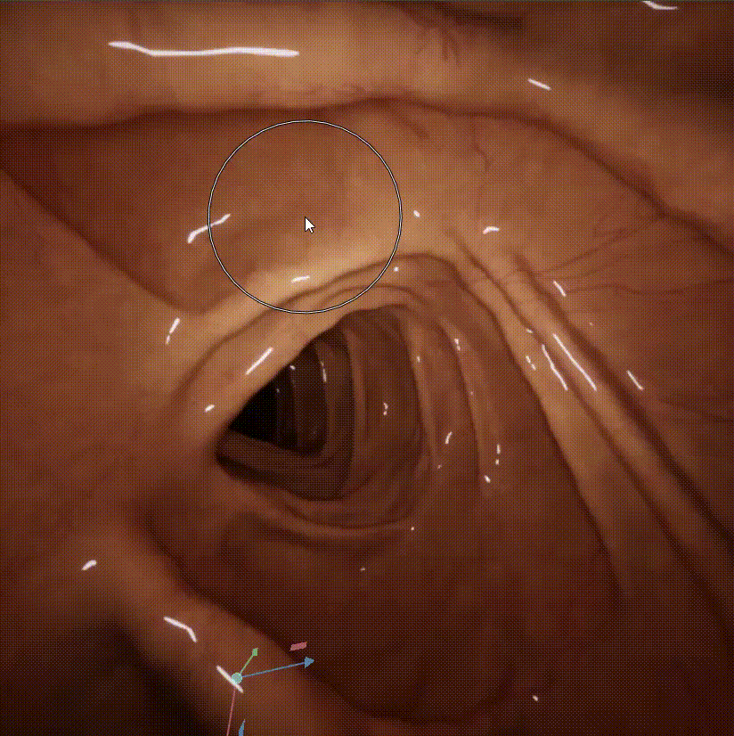
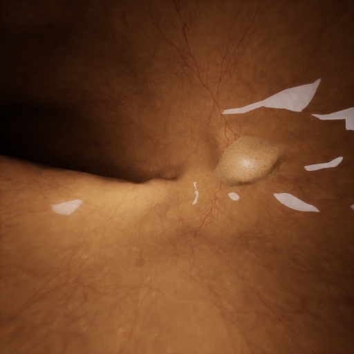
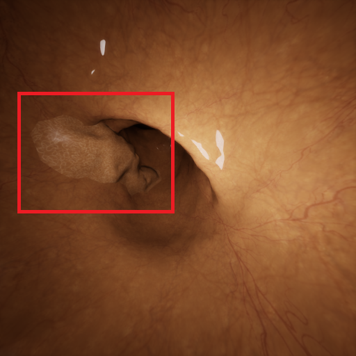

# Scene Customization Tutorial

This tutorial shows how to edit scenes in NVIDIA Omniverse to support different endoscopic simulation scenarios with EndoX. It covers authoring pathological textures, introducing polyp geometry, and tuning material and post-processing properties.

**Contents**

- [Pathology Authoring](#pathology-authoring)
  - [1. Pathological Texture](#1-pathological-texture)
  - [2. Polyps](#2-polyps)
- [Material Editing](#material-editing)

---

## Pathology Authoring

### 1. Pathological Texture

#### Step 1 &mdash; Prepare Base and Pathology Textures

Start with the **normal mucosal texture** for the target GI organ. This texture should be UV-compatible with the organ mesh so that it wraps cleanly along the lumen.

Next, prepare one or more **pathological patterns** that will be blended onto the base mucosa. Two example patterns are provided below.

**Ulcerative colitis pattern**

  

**Bleeding / diffuse inflammation pattern**

  

#### Step 2 &mdash; Overlay the Pathology Pattern

Use an image editor (e.g. Photoshop, GIMP, Krita) or a programmatic approach (e.g. Python + Pillow) to composite the pathological pattern over the normal mucosal texture. Export the result as a renderable texture in `.png` or `.tga` format.

#### Step 3 &mdash; Link the Pathological Texture in Omniverse

After exporting the pathological texture, assign it to the organ material in Omniverse.

1. Open the EndoX scene in Omniverse Code or your Kit-based app.
2. In the **Content Browser**, navigate to the folder that contains the exported pathological texture.
3. In the **Stage** tree, select the GI organ mesh.
4. In the material or shader properties, locate the diffuse / albedo texture input.
5. Replace the original mucosal texture path with the exported pathological texture.
6. Confirm that the organ surface updates in the viewport. If the texture appears rotated, stretched, or offset, verify the mesh UVs and texture tiling settings.

  

<em>Navigate the Omniverse folder tree to locate the organ material, then link the pathological texture file.</em>

##### Alternative: Texture Painting

Instead of compositing in an external editor, you can paint pathology directly onto the organ surface using Omniverse's texture painting tools.

1. Select the organ mesh.
2. Open the texture painting workflow in Omniverse.
3. Choose the target material channel (typically diffuse / albedo).
4. Paint the pathological regions directly onto the mucosal surface.
5. Save or bake the painted result to a texture file.

  

<em>Texture painting allows precise, localised placement of pathological patterns on the organ surface.</em>

#### Step 4 &mdash; Run AOV Capture for Synthetic Data Generation

Once the pathological texture is assigned, the scene is ready for EndoX AOV capture. Use the EndoX extension panel to configure the camera path, output directory, resolution, and desired modalities, then click **Capture Selected Modalities**.

Example captured frames with pathological texture applied:

  
  
  

---

### 2. Polyps

Organ meshes that contain polyp structures require **pathological CT input**.

1. Obtain pathological CT data that includes polyp-bearing anatomy.
2. Input the pathological CT in DICOM format into the **CT-to-mesh pipeline** provided by the EndoX extension (see the 3-D Model Import section of the [main README](../../../README.md)).
3. After processing, the resulting mesh will reflect the polyp structures present in the source CT.

Example rendered frames from a polyp-bearing mesh:

  
  

---

## Material Editing

Post-processing effects are configured to simulate optical imperfections common in clinical endoscopes. These effects can be combined and randomised across synthetic frames for domain randomisation.

### Editing Material Properties

To adjust material parameters for the organ surface:

1. In the **Stage** tree, select the material prim assigned to the organ mesh.
2. Open the **Properties** panel to access shader inputs such as albedo, roughness, metallic, and subsurface scattering.
3. Modify the values to match the desired tissue appearance.

### Editing Post-Processing Effects

To configure post-processing effects that apply to the rendered output:

1. Open **Render Settings** &rarr; **Post-Processing** panel.
2. Adjust effects such as bloom, chromatic aberration, vignetting, lens distortion, or motion blur to replicate the optical characteristics of a real endoscope.
3. Preview the result in the viewport before running a full capture.

> **Tip:** Vary post-processing parameters across capture runs to increase visual diversity in the synthetic dataset.
