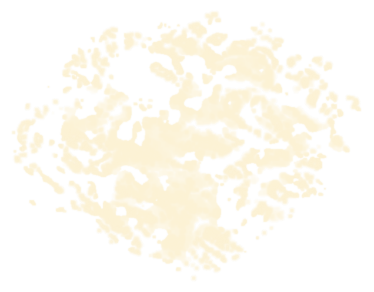
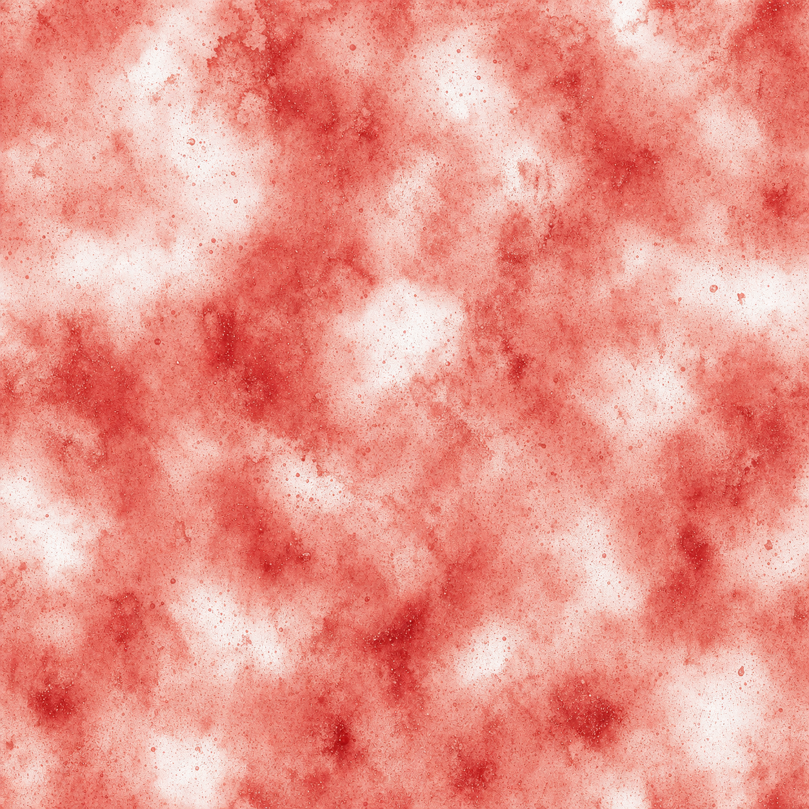
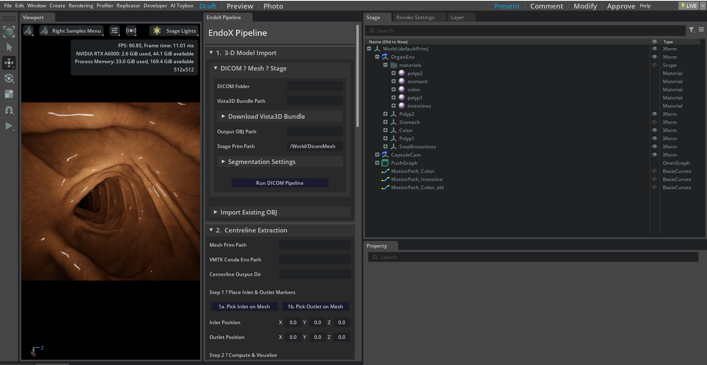
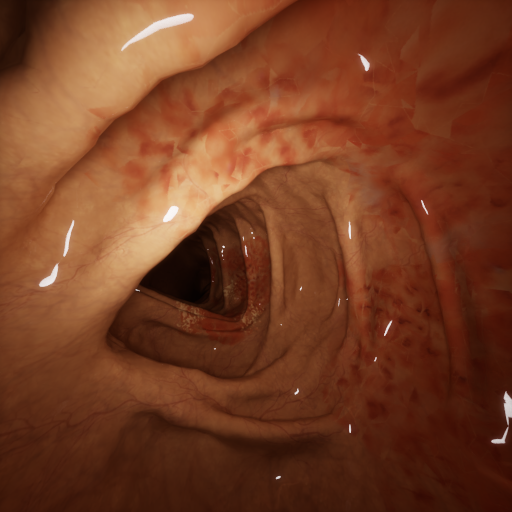
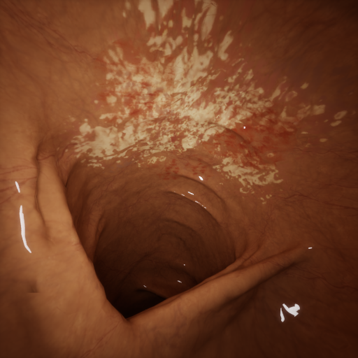
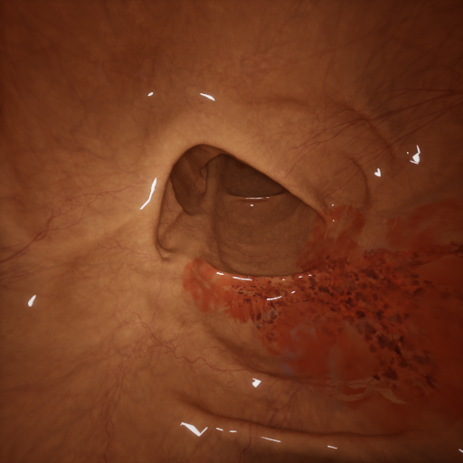

# Pathological Texture Authoring Tutorial

This tutorial shows how to author pathological gastrointestinal (GI) mucosal textures in NVIDIA Omniverse and prepare the scene for EndoX synthetic data generation. The workflow starts from a normal mucosal texture, overlays disease patterns such as ulcerative colitis or bleeding, links the resulting texture to the organ material, and then runs AOV capture.

## Assets

The tutorial media is stored in `assets/pathological_texture/`.

| Asset | Purpose |
|---|---|
| [`normal_colon_texture.tga`](assets/pathological_texture/normal_colon_texture.tga) | Base normal mucosal texture for the GI organ. |
| [`ulcerative_colitis_pattern.png`](assets/pathological_texture/ulcerative_colitis_pattern.png) | Ulcerative colitis pattern overlay. |
| [`bleeding_pattern.png`](assets/pathological_texture/bleeding_pattern.png) | Diffuse bleeding/inflammation pattern overlay. |
| [`omniverse_texture_linking.png`](assets/pathological_texture/omniverse_texture_linking.png) | Omniverse material and texture-linking example. |
| [`texture_painting.mp4`](assets/pathological_texture/texture_painting.mp4) | Texture painting demonstration recording. |
| `0029.png`, `0534.png`, `0674.png` | Example captured RGB outputs after pathological texture authoring. |

## 1. Prepare Base and Pathology Textures

Start with the normal mucosal texture for the target GI organ. This texture should already be UV-compatible with the organ mesh so that it wraps cleanly along the lumen.

[Download or inspect the base normal mucosal texture](assets/pathological_texture/normal_colon_texture.tga).

Prepare one or more pathological patterns that will be blended onto the base mucosa. In this example, two patterns are provided:

**Ulcerative colitis pattern**

**Bleeding or diffuse inflammation pattern**

Keep each pathological pattern as a separate image layer when possible. This makes it easier to tune opacity, scale, rotation, and masking before exporting the final pathological texture.

## 2. Overlay the Pathology Pattern

Use an image editor such as Photoshop, GIMP, Krita, or Substance 3D Painter to composite the pathology pattern over the normal mucosal texture.

Recommended layer workflow:

1. Open `normal_colon_texture.tga` as the base layer.
2. Add `ulcerative_colitis_pattern.png` or `bleeding_pattern.png` as a new layer above the base mucosa.
3. Resize and tile the pathology layer so that the pattern follows the organ scale. Avoid overly large repeated features unless the disease region is intentionally focal.
4. Set the pathology layer blend mode to `Overlay`, `Multiply`, `Soft Light`, or `Normal` with reduced opacity, depending on the desired appearance.
5. Add a layer mask to restrict the pathology to clinically meaningful regions. For focal lesions, paint the mask locally; for diffuse inflammation, use broad low-frequency masks.
6. Export the result as a renderable texture such as `pathological_colon_texture.png`, `pathological_colon_texture.jpg`, or `pathological_colon_texture.tga`.

When authoring pathology, preserve enough of the original mucosal detail for realistic endoscopic appearance. The pathological layer should change color, density, and local structure without flattening the normal vascular and fold texture.

## 3. Link the Pathological Texture in Omniverse

After exporting the pathological texture, assign it to the organ material in Omniverse.

1. Open the EndoX scene in Omniverse Code or your Kit-based app.
2. In the **Content Browser**, navigate to the folder that contains the exported pathological texture.
3. In the **Stage** tree, select the GI organ mesh.
4. In the material or shader properties, locate the diffuse/albedo texture input. Depending on the material, this may appear as `diffuse_texture`, `Base Color`, `Albedo`, or a connected image node.
5. Replace the original mucosal texture path with the exported pathological texture.
6. Confirm that the organ surface updates in the viewport. If the texture appears rotated, stretched, or offset, verify the mesh UVs and texture tiling settings.

The screenshot below shows the Omniverse folder tree and material-editing context used to link a pathological texture to the organ.

### Alternative: Author with Texture Painting

Instead of compositing the texture in an external image editor, you can paint pathology directly onto the organ surface. This is useful for small ulcers, local bleeding, or manually controlled disease distributions.

1. Select the organ mesh.
2. Open the texture painting workflow in Omniverse or your preferred connected authoring tool.
3. Choose the target material channel, typically diffuse/albedo.
4. Paint the pathological regions directly onto the mucosal surface.
5. Save or bake the painted result to a texture file.
6. Re-link the saved painted texture to the organ material if it is not already connected.

Texture painting demonstration:

<video controls width="720" src="assets/pathological_texture/texture_painting.mp4">
  <a href="assets/pathological_texture/texture_painting.mp4">Open the texture painting recording</a>
</video>

If your Markdown renderer does not support embedded video, open [`texture_painting.mp4`](assets/pathological_texture/texture_painting.mp4) directly.

## 4. Run AOV Capture for Synthetic Data Generation

Once the pathological texture is assigned, the scene is ready for EndoX AOV capture.

1. Enable the EndoX extension and open the EndoX panel.
2. Verify that the organ mesh, camera path, and lighting are configured.
3. In **AOV Data Capture**, set the camera prim path, output directory, resolution, frame count, and samples per pixel.
4. Select the required modalities, such as RGB, depth, surface normals, optical flow, camera pose, or occlusion.
5. Click **Capture Selected Modalities** to generate the dataset.

The resulting RGB frames show the authored pathological mucosa under the same camera trajectory and rendering conditions used for the synthetic dataset.

## Practical Tips

- Keep a copy of the original normal mucosal texture before editing.
- Use masks to control pathology location instead of applying a uniform full-surface overlay for every case.
- Save each pathology variant with descriptive names, such as `colon_uc_mild.png`, `colon_uc_severe.png`, or `colon_bleeding_diffuse.png`.
- Check the material in viewport lighting before running a long capture job.
- Generate multiple pathology variants to increase dataset diversity across disease type, severity, location, and camera viewpoint.

